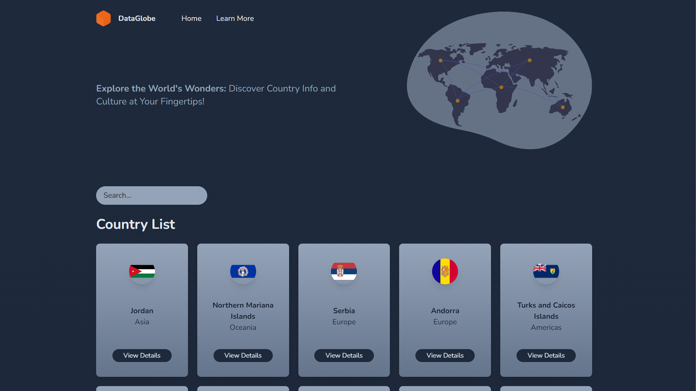

<!-- Improved compatibility of back to top link: See: https://github.com/othneildrew/Best-README-Template/pull/73 -->
<a name="readme-top"></a>

<br />
<div align="center">
  <h1 align="center">Data Globe</h1>

  <p align="center">
    <em>A simple Next.js app to browse information about countries. Powered by restcountries.</em>
    <br />
    <br />
    <a href="https://data-globe.vercel.app">View Demo</a>
    ·
    <a href="https://github.com/blueycode/data-globe/issues">Report Bug</a>
    ·
    <a href="https://github.com/blueycode/data-globe/issues">Request Feature</a>
  </p>
</div>

<!-- ABOUT THE PROJECT -->
## About The Project


This repository makes part of Bluey Code's project. Its entire development process has been recorded for teaching purposes and can be accessed on <a href="https://www.youtube.com/@blueycode">Bluey Code's YouTube channel</a>.



### Assets

* Check `video-assets` folder

### Built With

* [Next.js](https://nextjs.org/)
* [Tailwind](https://tailwindcss.com/)
* [Restcountries API](https://restcountries.com/)
* [react-icons](https://www.npmjs.com/package/react-icons)
* [react-awesome-reveal](https://www.npmjs.com/package/react-awesome-reveal)

### To-do List

- [x] Project setup *(cleanup, metadata, favicon)* 
- [x] Develop navbar
- [x] Develop banner
- [x] Develop country list *(includes search feature and animation)*
- [x] Develop country details page
- [x] Deploy on Vercel

<!-- LIVE DEMO -->
### Live Demo

You can check a running version of this project <a href="https://data-globe.vercel.app">here</a>

<p align="right">(<a href="#readme-top">back to top</a>)</p>

<!-- GETTING STARTED -->
## Getting Started

To get a local copy up and running follow these simple example steps.

### Prerequisites

This is an example of how to list things you need to use the software and how to install them.

* Node.js 16.8 or later

### Installation

1. Clone the repo
   ```sh
   git clone https://github.com/blueycode/data-globe.git
   ```
2. Install NPM packages
   ```sh
   npm install
   ```

<p align="right">(<a href="#readme-top">back to top</a>)</p>


<!-- CONTRIBUTING -->
## Contributing

Contributions are what make the open source community such an amazing place to learn, inspire, and create. Any contributions you make are **greatly appreciated**.

If you have a suggestion that would make this better, please fork the repo and create a pull request. You can also simply open an issue with the tag "enhancement".
Don't forget to give the project a star! Thanks again!

1. Fork the Project
2. Create your Feature Branch (`git checkout -b feature/AmazingFeature`)
3. Commit your Changes (`git commit -m 'Add some AmazingFeature'`)
4. Push to the Branch (`git push origin feature/AmazingFeature`)
5. Open a Pull Request

<p align="right">(<a href="#readme-top">back to top</a>)</p>